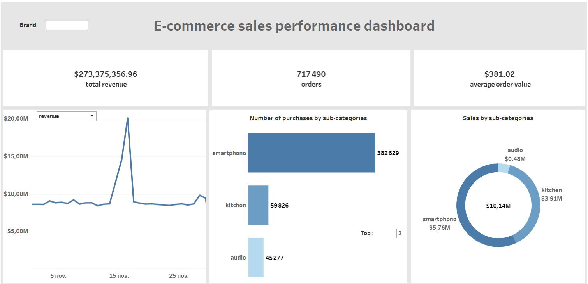
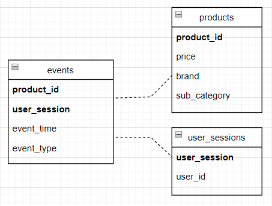

# Project overview

This project aimed to do an exploratory data analysis on a huge retail e-commerce dataset (9GB).                                                                           
This was done using the pyspark library, which allows us to use Apache Spark on Python.
[Apache Spark](https://spark.apache.org/) is a data processing framework that can quickly perform processing tasks on very large datasets.

Exploratory data analysis is focuses on getting information from the data and store's key performance indicators (KPIs).
KPIs help businesses to monitor their performances and make the right decisions in terms of goals and strategies.

Some questions answered in this project :

* What are the highest grossing products and brands ?
* What are the brands with the highest average conversion rates ? 
* What is the average order value and the average number of items per orders ?

For example, based on the average order value and the average number of items per order, we can decide whether there is
a need to employ an up-sell or cross-sell strategy.

In the data visualization part, a dashboard has been made in Tableau :





A user can interact with this tool and have access to charts
and KPIs about the sales performance of a chosen brand. This dashboard is available on the website of Tableau Public with this [link](https://public.tableau.com/views/e-commercesalesperformancedashboard/Tableaudebord1?:language=fr-FR&:display_count=n&:origin=viz_share_link).

The data has been restructured into 3 smaller datasets, in order to remove the redundancies in the original one :





In this relational model, we have the table "product"s which holds information from the products,
"user_sessions" which contains information from the website sessions and "events" containing information from the website events.

# Code and Resources Used 
**Python Version :** 3.9.12                                                                 
**Packages :** pyspark                                                          
**For Web Framework Requirements :**  ```pip install -r requirements.txt```                                                 
**Dataset :** https://www.kaggle.com/mkechinov/ecommerce-behavior-data-from-multi-category-store   
**Tableau Desktop Public Edition :** 2022.3.1 
